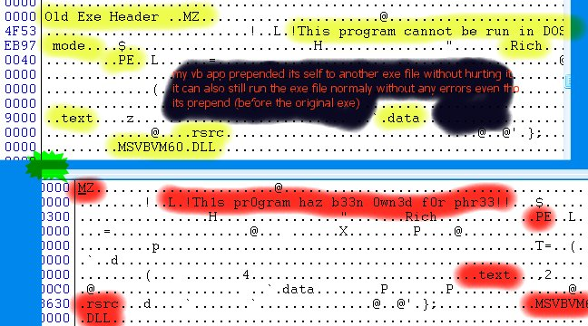



## Prepend PE\(VB\)  to a  PE file w/o damage to the original PE

### Description

I made this project after reading a paper about asm. they were talking about how programers

were amazzed to find out that a program will still run even when appended by another.

then they took it to the next step, prepending an still getting it to work. then an

even greater step, filling the programs white space up with code and running the program

+ the code that filled the white space without any errors.

i got it to work in asm and wondered if there was any way to get any kind of prepend, append,

or white space fill effect in a vb writen app. all i got was the prepend. append only

worked if i knew what compiler made the program (masm hehehe, not vb6 or vc++...sorry lads).
 
### More Info
 
Bigger exe's, slow execution

             |
---                |---
**Submitted On**   |2002-06-18 00:49:44
**By**             |[rae the coder](https://github.com/Planet-Source-Code/PSCIndex/blob/master/ByAuthor/rae-the-coder.md)
**Level**          |Intermediate
**User Rating**    |4.3 (13 globes from 3 users)
**Compatibility**  |VB 6\.0
**Category**       |[Files/ File Controls/ Input/ Output](https://github.com/Planet-Source-Code/PSCIndex/blob/master/ByCategory/files-file-controls-input-output__1-3.md)
**World**          |[Visual Basic](https://github.com/Planet-Source-Code/PSCIndex/blob/master/ByWorld/visual-basic.md)
**Archive File**   |[Prepend\_PE957306182002\.zip](https://github.com/Planet-Source-Code/rae-the-coder-prepend-pe-vb-to-a-pe-file-w-o-damage-to-the-original-pe__1-35981/archive/master.zip)

